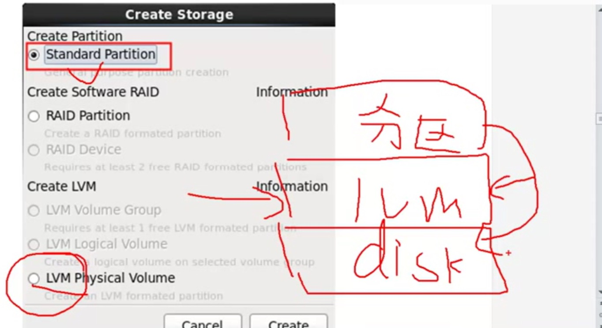

------------------------------------------------------

# 2017年11月17日14:58:57


```

看看自己系统是多少位
uname -m
x86_64


uname -a

Darwin bogon 16.7.0 Darwin Kernel Version 16.7.0: Wed Oct 4 00:17:00 PDT 2017; root:xnu-3789.71.6~1/RELEASE_X86_64 x86_64


ls -ld /lib64/

drwxr-xr-x 2 root root 4096 Jun 20 00:38 **/lib64/**
```


```

看看自己装的啥操作系统啊
cat /etc/redhat-release


看看内核啊
uname -r

4.4.0-78-generic

```

------------------------------------------------------
 




```
LVM 好比带了套, 性能差


NAT // 不对等
Bridged // 对等


```

------------------------------------------------------

# 2017年11月17日15:30:20 分区


```

硬盘使用前,----------一般要分区--------格式化(创建文件系统) ---------存放数据
房子使用前, -------一般要隔断------装修,买家具 ---------住人


一块硬盘:
主分区, 扩展分区, 逻辑分区

主分区+扩展分区数量<=4, 其中一个主分区可以用一个扩展分区替代, 扩展分区最多只能有一个.
扩展分区不能直接使用,还需要在上面创建逻辑分区,逻辑分区可以有多个

主分区+扩展分区 编号只能1-4. 逻辑分区的编号只能从5开始


区: 数据不是特别重要的业务(集群的某个节点)


/boot 引导分区 200m 主分区
swap 交换分区 内存的1.5倍   内存大于8g 就给 8-16g

/ Linux 所有目录顶点, 风剩余所有空间


2. 数据重要(数据库, 存储服务器)

/boot 引导分区 200m  主分区

swap 交换分区 内存的1.5倍   内存大于8g 就给 8-16g

/ Linux 所有目录顶点,100-200g

/data 所有,存放数据

3.特大网站
/boot 引导分区 200m  主分区

swap 交换分区 内存的1.5倍   内存大于8g 就给 8-16g

/ Linux 所有目录顶点,100-200g
剩余空间不分配, 根据需求来
```

------------------------------------------------------


------------------------------------------------------


------------------------------------------------------
