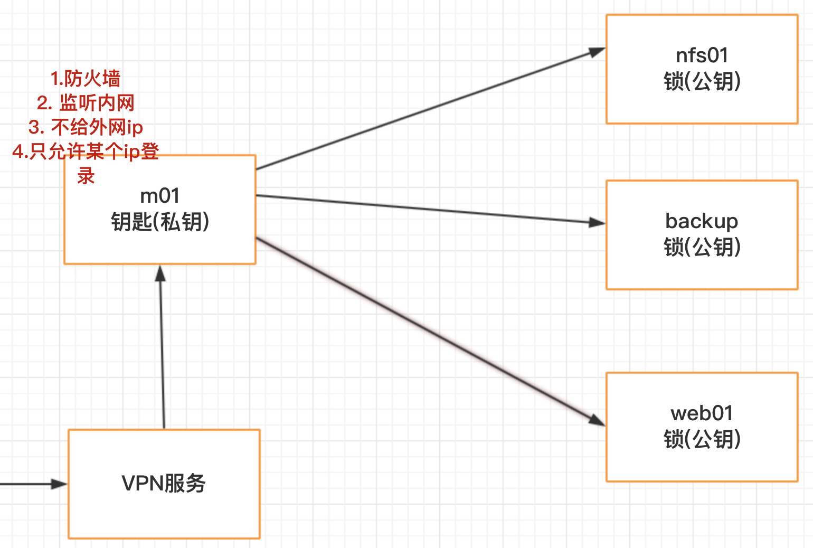

# 创建秘钥对

# 1. 创建一个用户

useradd user01
echo 123456|passwd --stdin user01


# 2. 创建秘钥

```

l.请一路按回车键即可。密钥的生成可以在任意机器上，且生成一次密钥即可。
2.请仔细看建立密钥过程中的屏幕信息，可以看到密钥的存放路径为用户家目录下的.ssh 目录。
3.有关ssh-keygen 说明请man ssh-keygen,或参考htp://lamp.linux.gov.cn/OpenSSH/ ssh-keygen.html

-t type

Specifiee the type of key to create.
The poeeible valuee are'real" for
protocol versionI and"rsa" or"dsa" for protocol version 2.


非交互式创建秘钥
2. echo -e "\n" | ssh-keygen -t dsa -N ""

```


# 3.发送公钥的命令  ssh-copy-id

```

// 如果是默认的22端口的话
ssh-copy-id -i .ssh/id_rsa.pub xxx@10.10.1.1


// 不是默认的
ssh-copy-id -i .ssh/id_rsa.pub "-p 62233 xxx@10.10.1.1"  // -p 后面有空格


// expect

```


# 4. ssh -p62256 root@10.10.1.1 /sbin/ifconfig eth0


# 5 . 流程

```

1、所有机器创建用户及密码
useradd oldgirl ↓
echo 123456|passwd--stdin oldgirl
id oldgirl
su - oldgirl

2、m01创建密钥对
ssh-keygen -t dsa 一回车
ssh-keygen -t dsa -P '' -f ~/.ssh/id_dsa >/dev/null 2>&1↓

3、m01分发公钥↓
ssh默认22端口↓
ssh-copy-id -i .ssh/id_dsa.pub  oldgirl@172.16.1.41
更改过的ssh端口↓
ssh-copy-id -i .ssh/id_dsa.pub "-p 52113 oldgirl@172.16.1.41"↓

4. 测试
ssh -p52113 oldgirl@272.16.1.41 /sbin/ifconfig eth0
ssh -p52113 oldgirl@172.6.1.41 /sbin/ifconfig eth0
ssh -p52113 oldgirl@272.16.1.41 /sbin/ifconfig eth0

```

#  7.  企业里实现ssh方案: 3种↓


```

企业里实现ssh方案: 3种↓
1、直接root ssh key.
条件: 允许root ssh登录。↓
2、sudo提权实现没有权限用户拷贝↓
3、利用suid实现没有权限用户拷贝(做思维扩展了解)

```

2、sudo提权实现没有权限用户拷贝
```
 
visudo 改文件

oldboy ALL=(ALL) NOPASSWD: ALL
oldgirl ALL= NOPASSWD: /usr/bin/rsync  // 没有切换角色的权限


// 自动化管理

echo "oldgirl ALL= NOPASSWD: /usr/bin/rsync">>/etc/sudoers
visudo -c

```

```

2、sudo提权实现没有权限用户拷则
配置sudoers:

echo "oldgirl ALL= NOPSSWD:/usr/bin/rsync">>/etc/sudoers
visudo -c↓

scp -P52113 hosts oldkir@172.16.1.31:~

远程sudo:
ssh -p52113 -t oldkir1@172.16.1.31 sudo rsync  ~/hosts /etc/hosts 

```

# 要想实现远程sudo有两种方法(-t 或者注释掉Defaults requiretty )

```
vi /etc/sudoers
# Disable "ssh hostname sudo <cmd>",because it will show the password in clear.
# You have to run"ssh -t hostname sudo <cmd>".
#
Defaults requiretty 


远程sudo:
ssh -p52113 -t oldkir1@172.16.1.31 sudo rsync  ~/hosts /etc/hosts 

```

# sh xxx.sh

```

scp -P5113 hosts oldgir1@172.16.1.31:~
ssh -P5113 -t oldgir1@172.16.1.31 sudo rsync ~/hosts /etc/hosts

scp -P5113 hosts oldgir1@172.19.1.31:~
ssh -P5113 -t oldgir1@172.16.19.31 sudo rsync ~/hosts /etc/hosts

scp -P5113 hosts oldgir1@172.20.1.31:~
ssh -P5113 -t oldgir1@172.16.20.31 sudo rsync ~/hosts /etc/hosts


```


# rsync -avz hosts -e 'ssh -p 52113' ssss@172.16.19.31:~

```

隧道模式
1.增量
2. 加密

```


# 跳板机安全

```

1.防火墙
2.监听内网
3.不给外网IP


```