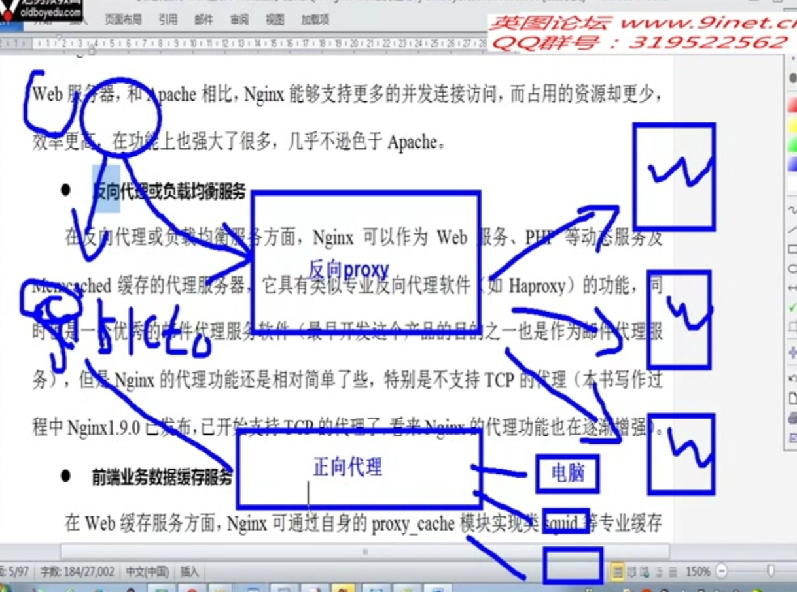

从软件大的功能应用方面，Nginx 不但是一个优秀的Web 服务软件，还可以具有反向
代理负载均衡功能和缓存服务功能。在反向代理负载均衡功能方面，它类似于大名鼎鼎的
LVS 负载均衡以及Haproxy专业代理软件，但是Nginx 部署起来更为简单、方便; 在缓存
服务功能方面，它又类似于squid 等专业的缓存服务软件。

代理相关:lvs ,keepalived,haproxy,nginx, apache,heartbeat (此行都是*)
网站缓存: squid k.nginx ,varnish


可针对静态资源高速高并发访问及缓存;
可使用反向代理加速，并且可进行数据缓存;
具有简单负载均衡、节点健康检查和容错功能; |
支持远程FastCGI 服务的缓存加速;
支寺FastCGI、Uwsgi、SCGI、and Memcached Servers 的加速和援存;
支持SSL、TLS.SNI;


# web 服务软件


# 反向代理或负载均衡服务

```
反向代理 : 代替用户请求代理服务器, 代替外部的用户请求内部的服务器

```
反向代理和正向代理


```
老板说王经理帮我倒杯水, 王经理让小刘倒水, 小刘倒完水拿给王经理,王经理拿给老板

```

负载均衡

```
老板说王经理帮我倒杯水, 王经理让小刘倒水, 小刘倒完水直接拿给老板

```


# 前端业务数据缓存


# select和epoll两个比喻

```
第一个比喻:
假设你在大学读书，住的宿舍楼有很多间房间，你的朋友要来找你。select 版宿管大
妈就会带着你的朋友挨个房间去找，直到找到你为止。而epoll 版宿管大妈会先记下每位
入住同学的房间号，你的朋友来找你时，只需告诉你的朋友你住在哪个房间即可，不用亲
自带着你的朋友满宿舍楼找人了。如果同时来了100个人，都要找自己住这栋楼的同学时，
select 版和epoll 版宿管大妈，谁的效率更高，就很明显了。

```


```

第二个比喻:
select 的调用复杂度是线性的，即0(n).举个例子，一个保姆照看一群孩子，如果把
孩子是否需要尿尿比作网络I/0事件，select 的作用就好比这个保姆挨个询问每个孩子:
你要尿尿吗? 如果孩子回答是，保姆则把孩子领出来放到另外一个地方。当所有孩子询问
完之后，保姆领着这些要尿尿的孩子去上厕所(处埋网络I /0事件)。
还是以保姆照看一群孩子为例，在epoll 机制下，保姆不再需要挨个的询问每个孩子
是否需要尿尿。取而代之的是，每个孩子如果自己需要尿尿的时候，自己主动的站到事先
约定好的地方，而保姆的职责就是查看事先约定好的地方是否有孩子。如果有小孩，则领
着孩子去上厕所(网络事件处理)。因此，epoll 的这种机制，能够高效的处理成千上万的并发连接,而且性能不会随着连接数量的增多而下降太多.

```


# 软件安装

```


l、rpm-ivh 包名.rpm↓
有依赖问题，安装A,A需要先安装B。↓
缺点: 不能定制。↓
2、yum安装自动解决rpm安装的依赖问题，安装更简单化。↓
优点: 简单、易用、高效↓
缺点: 不能定制。↓
3、编译(C语言源码-编译二进制等)↓
./configure (配置)，make(编译)，make install (安装) ↓
优点: 可以定制↓
缺点: 复杂、效率低。↓
4、定制化制作rpm包，搭建yum仓库，把我定制的rpm包放到yum仓库，进行yum安装。
优点: 结合了2的优点和3的优点。↓
缺点: 复杂。

```