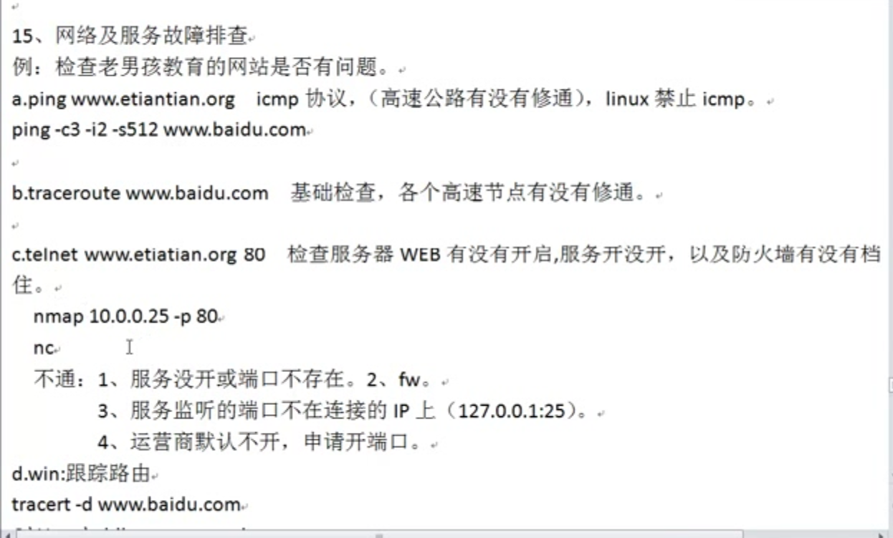

# 修改主机名


```

hostname  newname

/etc/sysconfig/network


/etc/hosts

```


# 网关配置 route -n  / route -rn

```

//第一网卡
cat /etc/sysconfig/network-scripts/ifcfg-eth0
GATEWAY=108.99.128.1


// 第二
/etc/sysconfig/network
GATEWAY=108.99.128.1

cat /etc/sysconfig/network


// 第三命令行---临时的
route add default gw 10.0.0.223
route del default gw 10.0.0.3

```


# 查看网络信息 ifconfig

```
// 一块网卡多个ip
ifconfig eth1:0 10.10.10.0 netmask 225.255.255.0 up

ifconfig eth1:0 10.10.10.12/24 up

上面的叫做别名ip :VIP,虚拟IP

ifconfig eth1:0 down
ifconfig eth1:1 down
  
```


# 辅助IP : ip addr add 10.0.1.2/24 dev eth1:3

```
centos 

heartbeat 高可用早期用的别名, centos6 下ha也是辅助IP


 keepalived 服务一直用的辅助IP


网卡重启别名就失效: 写成配置文件(/etc/sysconfig/network-scripts/ifcfg-eth0:1)
```


#  已知一个端口是223, 怎么查看这个端口对应的服务?>

```

lsof -i tcp:52113

lsof |grep del// 被进程占用的文件

 已知一个端口是223, 怎么查看这个端口对应的服务?>

```


# 已知一个端口是223, 怎么查看这个端口对应的服务? netstat -lntup|grep 22

```


```


#  禁止icmp协议就ping不同了


#  路由跟踪traceroute www.baidu.com

```
traceroute www.baidu.com -n

看每一跳
```


# telnet  看看端口开没开

```
telnet www.baidu.com 80

```

# nmap 10.1.1.1 -p 80
# nc



# 抓包工具 tcpdump

```
tcpdump -n icmp -i eth0

```
# nmap 烧苗


