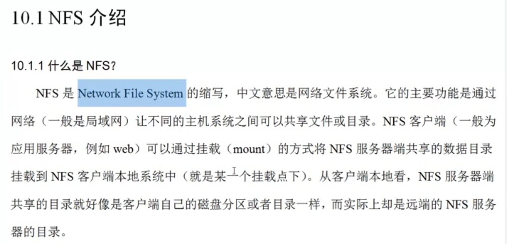

# 什么是NFS , 用来存图片视频文件的, 搞存储的.  共享存储


```

Network File System 
网络文件系统

让不同主机系统之间可以共享文件或者目录


```


# NFS 是独立的文件系统, 网络文件系统


#  NFS 是一台,   后面别人用的是Moosefs(mfs), GlusterFS, FastDFS

# NFS 效率不高, 用啥啊mfs, GlusterFS, 

# 公共的NFS系统


# NFS 每次重启它的端口都是不一样的 

# 每次重启端口都不一样, 又想让用户找到它, 这时候就需要RPC服务 


# NFS工作流程图(形象)


# NFS工作流程图(具体)


# centos6 RPC叫rpcbind.   centos7叫啥? 


# 开搞========================


#  NFS 软件列表

###  要部署NFS服务,  需要安装下面的软件包

####  房源
>  nfs-utils : NFS服务的主程序, 包括rpc.nfsd, rpc.mountd这两个daemons和相关文档说明, 以及执行命令文件等.


#### 中介
>  rpcbind: CentOS6.X 下面RPC的主程序, NFS可以视为一个RPC程序, 在启动任何一个RPC程序之前, 需要做好端口和功能的对应映射工作, 这个映射工作就是有rpcbind服务来完成的. 因此,在提供NFS服务之前I必须先启动rpcbind服务才行.


# rpm -aq nfs-utils rpcbind 看看上面的两个软件包是不是安装了


#  后面我们要自己做一个yum仓库 


#  保留安装包

```

vim /etc/yum.conf 

[main]

cachedir=/var/cache/yum/$basearch/$releasever

keepcache=0

debuglevel=2

logfile=/var/log/yum.log

exactarch=1

obsoletes=1

gpgcheck=1

plugins=1

installonly_limit=5

bugtracker_url=http://bugs.centos.org/set_project.php?project_id=23&ref=http://bugs.centos.org/bug_report_page.php?category=yum

distroverpkg=centos-release


// 将keepcache 改为1, yum install 下载软件的安装包就不自动删除了, 保存在
r
cachedir=/var/cache/yum/$basearch/$releasever

```


# 基础软件安装

```

yum install lrzsz nmap tree dos2unix nc -y

打补丁
yum update 或者 yum upgrade

```


# -y是不提示直接装


# rpc 的端口111

```

netstat -lntup|grep rpc

udp 0 0 0.0.0.0:829  0.0.0.0:*  22278/**rpc**bind       

udp 0 0 0.0.0.0:111  0.0.0.0:*  22278/**rpc**bind       

udp6  0 0 :::829 :::* 22278/**rpc**bind       

udp6  0 0 :::111

```

# rpcinfo -p localhost (看rpc的房源)

```

program vers proto  port service

 100000 4  tcp 111 portmapper

 100000 3  tcp 111 portmapper

 100000 2  tcp 111 portmapper

 100000 4  udp 111 portmapper

 100000 3  udp 111 portmapper

 100000 2  udp 111 portmapper

```

# 别人的================================

# 啃爹的玩意从centOS7 开始 使用systemd服务来代替daemon


#  原来的 service 命令与 systemctl 命令对比

| daemon命令 | systemctl命令 | 说明 |
|---|---|---|
| service [服务] start 	| systemctl start [unit type] 		| 启动服务 |
| service [服务] stop		| systemctl stop [unit type] 		| 停止服务 |
| service [服务] restart  | systemctl restart [unit type] 	| 重启服务 |


> 此外还是二个systemctl参数没有与service命令参数对应

```
status：参数来查看服务运行情况
reload：重新加载服务，加载更新后的配置文件（并不是所有服务都支持这个参数，比如network.service）

**应用举例：**

#启动网络服务
systemctl start network.service

#停止网络服务
systemctl stop network.service

#重启网络服务
systemctl restart network.service

#查看网络服务状态
systemctl status network.serivce
```

#  init 命令与systemctl命令对比

| init命令 | systemctl命令 | 说明 |
| --- | --- | --- |
| init 0 | systemctl poweroff | 系统关机 |
| init 6 | systemctl reboot | 重新启动 |


与开关机相关的其他命令：

| systemctl命令 | 说明 |
| --- | --- |
| systemctl suspend | 进入睡眠模式 |
| systemctl hibernate | 进入休眠模式 |
| systemctl rescue | 强制进入救援模式 |
| systemctl emergency | 强制进入紧急救援模式 |


# OS7安装NFS

方法一

```

检查：rpm -qa nfs-utils rpcbind 最佳
yum install nfs-utils rpcbind -y
```

方法2： LANG = en

```


> yum grouplist | grep -i nfs
> yum groupinstall “NFS file server ” -y

```
启动 rpcbind (centos 6.8)

```

/etc/init.d/rpcbind status
/etc/init.d/rpcbind start

```

启动 rpcbind (centos 7)


```
systemctl start rpcbind.service
systemctl status rpcbind.service

```

启动NFS

```

systemctl start nfs-server.service

```

查看rpcbind 端口

```

netstat -lntup | grep rpcbind 默认端口 111
netstat -lntup | grep 111
rpcinfo -p localhost 查看rpclist

```

配置nfs配置文件(/etc/exports ] 默认是空的)


```

vim /etc/exports
示例：
/data 168.1.1.1(rw,sync,all_squash)
/data 168.1.1.*(rw,sync,all_squash)
sync：写入磁盘

```


使配置生效

```

exportfs -r

注：配置文件说明：

/opt/test 为共享目录

192.168.1.0/24 可以为一个网段，一个IP，也可以是域名，域名支持通配符 如: *.qq.com

rw：read-write，可读写；

ro：read-only，只读；

sync：文件同时写入硬盘和内存；

async：文件暂存于内存，而不是直接写入内存；

no_root_squash：NFS客户端连接服务端时如果使用的是root的话，那么对服务端分享的目录来说，也拥有root权限。显然开启这项是不安全的。

root_squash：NFS客户端连接服务端时如果使用的是root的话，那么对服务端分享的目录来说，拥有匿名用户权限，通常他将使用nobody或nfsnobody身份；

all_squash：不论NFS客户端连接服务端时使用什么用户，对服务端分享的目录来说都是拥有匿名用户权限；

anonuid：匿名用户的UID值，可以在此处自行设定。

anongid：匿名用户的GID值。

```


# 查看有什么启动命令 /etc/init.d/nfs 会输出命令集合

# showmount -e 127.0.0.1 查看挂载的目录


#  关闭防火墙

```


> systemctl stop firewalld.service
> systemctl disable firewalld.service


```


# 客户端需要启动 rpc

```

客户端也需要安装rpcbind, 建议nfs一起安装,便于使用showmount命令

centos6.8 /etc/init.d/rpcbind start
centos7 systemctl start rpcbind.service

或者将启动命令放入 /etc/rc.local 或者 使用 echo “/etc/init.d/rpcbind start” >> /etc/rc.local

客户端挂载目录 mount -t nfs 10.0.0.7:/data /mnt
echo “/bin/mount -t nfs 10.0..0.1:/data /mnt” >> /etc/rc.local

```
# #### nfs不能向服务端写数据,是权限的问题

```

cat /var/lib/nfs/etab

/script 192.168.42.*(rw,sync,wdelay,hide,nocrossmnt,secure,root_squash,no_all_squash,no_subtree_check,secure_locks,acl,no_pnfs,anonuid=65534,anongid=65534,sec=sys,rw,secure,root_squash,no_all_squash)

/data 192.168.42.*(rw,sync,wdelay,hide,nocrossmnt,secure,root_squash,no_all_squash,no_subtree_check,secure_locks,acl,no_pnfs,anonuid=65534,anongid=65534,sec=sys,rw,secure,root_squash,no_all_squash)

[root@nfs-1 data]# grep 65534 /etc/passwd nfsnobody:x:65534:65534:Anonymous NFS User:/var/lib/nfs:/sbin/nologin

chown -R nfsnobody /data

```


http://www.178linux.com/73581


# 我的================================

# systemctl stop rpcbind 停掉rpc

# 注意
```

OS7停掉rpc顺序如下

systemctl stop rpcbind.socket
systemctl stop rpcbind

先干掉rpcbind.socket
再干掉rpcbind

rpcinfo -p localhost
rpcinfo: can't contact portmapper: RPC: Remote system error - Connection refused
```

# 重启nfs: systemctl restart nfs-server


```

重启nfs会把 rpc启动  苦笑
```

# 启动完rpc做个检查看看rpc状态

```

 systemctl status rpcbind.service

```

# nfs 和 rpc开机自启动

```

`systemctl ``enable` `rpcbind.service`

`systemctl ``enable` `nfs-server.service`

```
# OS6的开机自启动

```

chkconfig rpcbind on
chkconfig nfs on

```

# 怎么看启动先后顺序 (OS6的)

```

ls /etc/rc.d/rc3.d/|grep -E "nfs|rpcbind"

```
# 哪里控制的启动顺序(OS6的)

```
head /etc/init.d/nfs

```


# systemctl stop

# systemctl restart