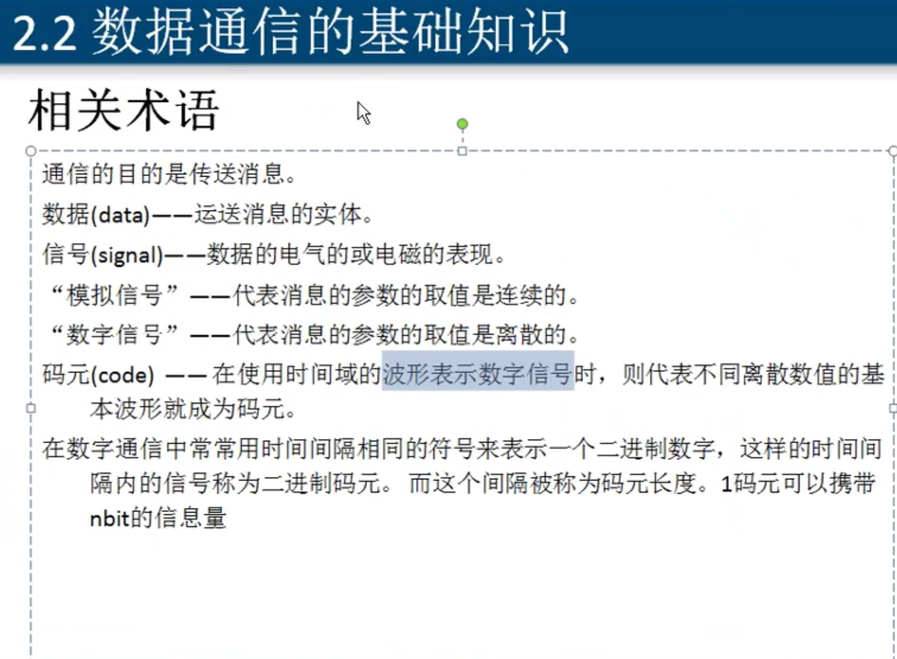

2.1 物理层的基本概念
2.2 数据通信的基础知识
2.3 物理层下面的传输媒体
2.4 信道复用技术
2.5 数字传输系统
2.6 带宽接入技术

# 2.1 物理层的基本概念

物理层解决如何在连接各种计算机的 ***传输媒体*** 上传输 ***数据比特流*** ，而不是指具体的传输媒体。
(光纤啊, 双绞线啊都叫媒体, 无线传输)
物理层的主要任务描述为:确定传输媒体的接口的一些特性，即:

机械特性: 例接口形状，大小，引线数目
电气特性: 例规定电压范围(-5V到+5V)
功能特性: 例规定-5V表示0，十5V表示1
过程特性: 也称规程特性，规定建立连接时各个相关部件的工作步骤

物理层的基本概念
机械特性
电气特性
功能特性
过程特性
# 2.2 数据通信的基础知识
打电话 也是数据通信
电视 也是数据通信
传真 也是数据通信
上网  也是数据通信

典型的数据通信模型

相关术语

码元(code) 在使用时间域的波形表示数字信号时,  则代表不同离散数值的基本波形就称码元