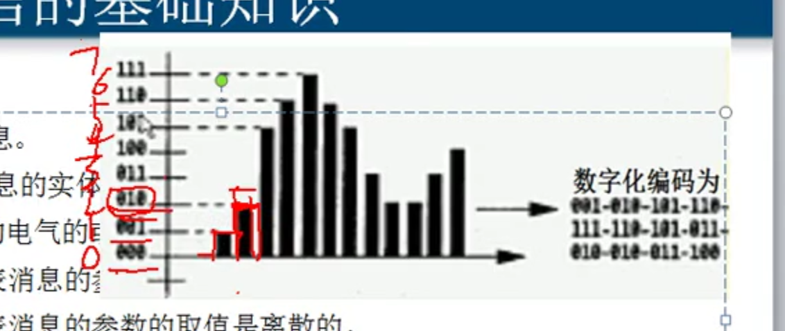
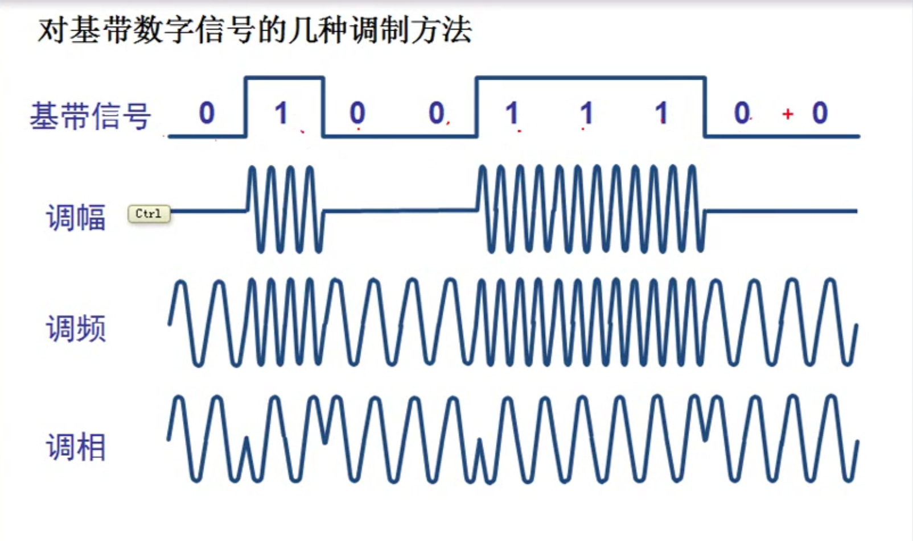
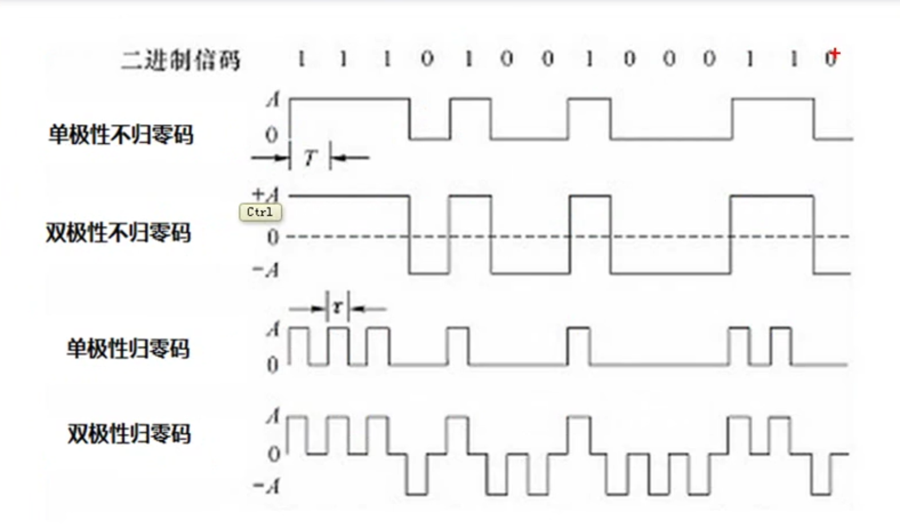
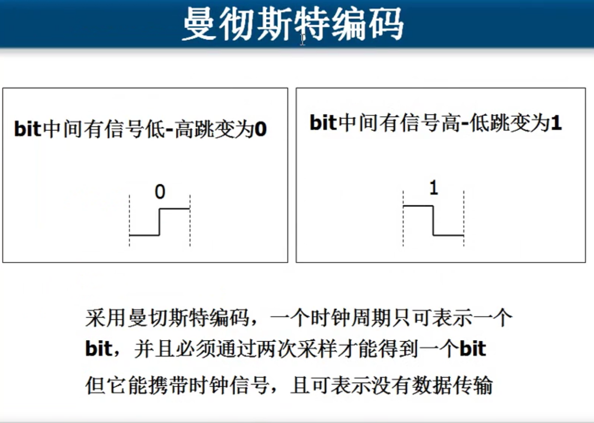
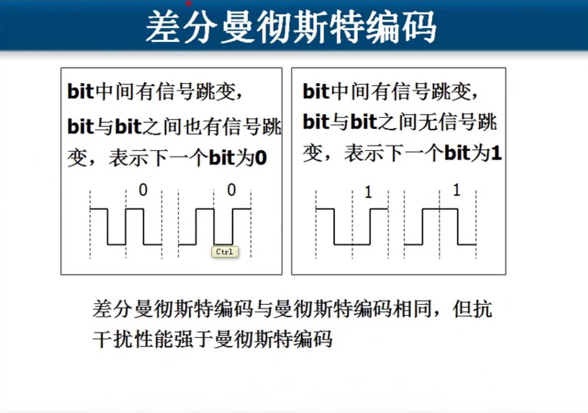

2.1 物理层的基本概念
2.2 数据通信的基础知识
2.3 物理层下面的传输媒体
2.4 信道复用技术
2.5 数字传输系统
2.6 带宽接入技术


# 2.1 物理层的基本概念

物理层解决如何在连接各种计算机的 ***传输媒体*** 上传输 ***数据比特流*** ，而不是指具体的传输媒体。
(光纤啊, 双绞线啊都叫媒体, 无线传输)
物理层的主要任务描述为:确定传输媒体的接口的一些特性，即:

机械特性: 例接口形状，大小，引线数目
电气特性: 例规定电压范围(-5V到+5V)
功能特性: 例规定-5V表示0，十5V表示1
过程特性: 也称规程特性，规定建立连接时各个相关部件的工作步骤

物理层的基本概念
机械特性
电气特性
功能特性
过程特性
# 2.2 数据通信的基础知识
打电话 也是数据通信
电视 也是数据通信
传真 也是数据通信
上网  也是数据通信


典型的数据通信模型


相关术语


码元(code) 在使用时间域的波形表示数字信号时,  则代表不同离散数值的基本波形就称码元

在数字通信中常常用时间间隔相同的符号来表示一个二进制数字, 这样的时间间隔内的信号称为二进制码元. 而这个间隔被称为码元长度. 1码元可以携带nbit的信息量.

时间间隔可以使1秒也可以是很多秒啊!

也有其他进制的码元

时间片段. 时间段, 相同时间段 

一个码元携带了3bit的信息量



### 信道

一个发送方一个接收方
A给B发信息是一个信道
B给A发消息又是一个信道

有关信道的几个基本概念

信道一般表示向一个方向传送信息的媒体。所以咱们说平常的通信线路往往包含一条发送信息的信道和一条接收信息的信道。

***单向通信***(单工通信)---只能有一个方向的通信而没有反方向的交互。(***广播***)

***双向交替通信***(半双工通信)---通信的双方都可以发送信息，但不能双方同时发送(当然也就不能同时接收)。(***对讲机***)

***双向同时通信***(全双工通信)-一一通信的双方可以同时发送和接收信息。(***打电话***)


### 基带(baseband)信号和带通(band pass)信号

基带(baseband)信号和带通(band pass)信号

***基带信号***(即基本频带信号)---来自信源的信号。像计算机输出的代表各种文字或图像文件的数据信号都属于基带信号。基带信号就是发出的直接表达了要传输的信息的信号，比如我们说话的声波就是基带信号

***带通信号***--把基带信号经过载波调制后，把信号的频率范围搬移到较高的频段以便在信道中传输(即仅在一段频率范围内能够通过信号?)

因此在传输距离较近时，计算机网络都采用基带传输方式由于在近距离范围内基带信号的衰减不大，从而信号内容不会发生变化。因此在传输距离较近时，计算机网络都采用基带传输方式。如从计算机到监视器、打印机等外设的信号就是基带传输的。


基带信号不是传不远吗? 咋搞,我们调它一调就可以了, 调制一下. 怎么调? 下面三种.
***几种最基本的调制方法***

■调幅(AM): 载波的振幅随基带数字信号而变化。
■调频(FM): 载波的频率随基带数字信号而变化。
■调相(PM): 载波的初始相位随基带数字信号而变化。



### 常用编码
单极性不归零码
1. 只使用一个电压值，用高电平表示1，没电压表示O.

双极性不归零码
  1. 用正电平和负电平分别表示二进制数据的1和0，正负幅值相等。

单极性归零码
1. 单极性归零码(RZ)即是以高电平和零电平分别表示二进制码1和0,而且在发送码1时高电平在整个码元期间T只持续一段时间t,其余时间返回零电平

双极性归零码
1. 正负零三个电平，信号本身携带同步信息。

曼彻斯特编码

差分曼彻斯特编码







曼彻斯特编码能够表示没有数据传输




表示0
```

bit中间有信号跳变, bit与bit之间也有信号跳变


```
表示1

```

bit中间有信号跳变, bit与bit之间无信号跳变

```
差分曼彻斯特编码与曼彻斯特编码相同, 但抗干扰性强于曼彻斯特编码


