```

数据链路层基本概念和基本问题

	数据链路层信道类型
		点到点信道
		广播信道

    链路和数据链路
	帧 帧头 帧尾 物理层 地址校验值

数据链路层解决的三个基本问题
	1. 封装成帧
	2. 透明传输
	3. 差错控制
```

# 数据链路层-基本概念


数据链路层基本概念及基本问题

```

基本概念
三个基本问题

```

两种情况下的数据链路层

```

使用点对点信道的数据链路层
使用广播信道的数据链路层

```
以太局域网(以太网)
扩展以太网
高速以太网

## 数据发送模型  数据链路层的简单模型

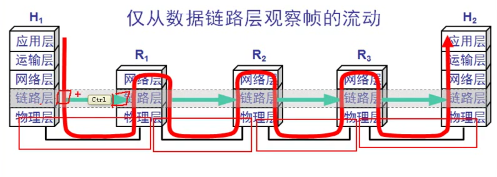

# 数据链路层的信道类型

数据链路层使用的信道主要有以下两种类型:
***点对点信道***。这种信道使用一对一的点对点通信方式。

***广播信道***。这种信道使用一对多的广播通信方式，因此过程比较
复杂。广播信道上连接的主机很多，因此必须使用专用的共享信
道协议来协调这些主机的数据发送。


# 链路和数据链路

链路(link)是一条点到点的物理线路段，中间没有任何其他的交换结点。

```

■一条链路只是一条通路的一个丝成部分。

```

数据链路( data link) 除了物理线路外，还必须有通信协议来控制这些
数据的传输。若把实现这些协议的硬件和软件加到链路上，就构成
了数据链路。

```

现最常用的方法是使用适配器(即网卡)来实现这些协议的硬件和
软件。

一般的适配器都包括了数据链路层和物理层这两层的功能。

```


# 帧  


# 封装成帧


封装成帧(framing)就是在一段数据的前后分别添加首部和尾部，然后就构成了一个帧。确定帧的界限。
首部和尾部的一个重要作用就是进行帧定界。


### 用控制字符进行帧定界的方法举例
试想:
帧还未发送完，发送端出了问题，只能重发该帧。接收端却收到了前面的
半截子帧”，它会抛弃吗? 为什么?


# 透明传输

若传输的数据是ASCI码中“可打印字符(共95 个)”集时，一切正常。
若传输的数据不是仅由“可打印字符”组成时，就会出问题，如下图。

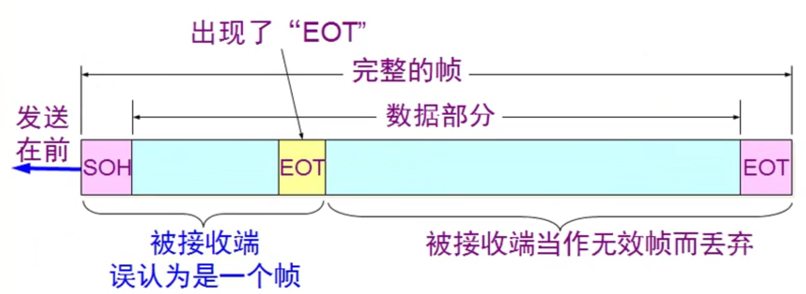


### 用字节填充法解决透明传输的问题

发送端的数据链路层在数据中出现控制字符“SOH”或“EOT”的前面插入一个转义
字符“ESC”(其十六进制编码是1B)。

`字节填充`(byte stuffing)或 `字守填充`(character stuffing)--接收端的数据链路层在
将数据送往网络层之前删除插入的转`义字符`。

如果转义字符也出现数据当中，那么应在转义字符前插入一个转义字符。当接收
端收到连续的两个转义字符时，就删除其中前面的一个。


# 差错控制


传输过程中可能会产生`比特差错:` 1可能会变成0而0 也可能变成1。
在一段时间内，传输错误的比特占所传输比特总数的比率称为`误码率`
BER (Bit Error Rate)。

误码率与信噪比有很大的关系。
为了保证数据传输的可靠性，在计算机网络传输数据时，必须采用各种
差错检测措施。

### 循环冗余检验CRC
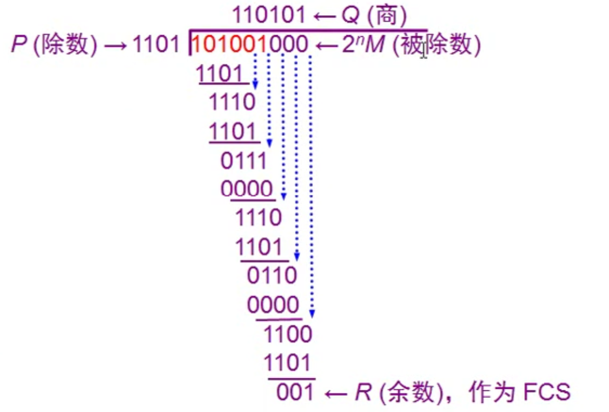
加的零必除数少一位


### 帧检验序列FCS
在数据后面添加上的冗余码称为`帧检验序列`FCS (Frame Check Sequence)。
循环冗余检验CRC和帧检验序列FCS并不等同。
■CRC是一种常用的`检错方法`，而FCS是添加在数据后面的`冗余码`。
■FCS 可以用CRC这种方法得出，但CRC 并非用来获得FCS 的唯一方
法。

### 接收端对收到的每一帧进行CRC 检验
检验:
```

若得出的余数R=0,则判定这个帧没有差错，就接受(accept)。
若余数R0,则判定这个帧有差错，就丢弃。

```
特点:
```

但这种检测方法并不能确定究竟是哪一个或哪几个比特出现了差
错。
只要经过严格的挑选，并使用位数足够多的除数P,那么出现检测
不到的差错的概率就很小很小。

```
关于CRC的更多的知识
http://blog.chinaunix.net/u2/69737/showart_1658667.html


# 两种情况下的数据链路层
### 使用点对点信道的数据链路层
### 使用广播信道的数据链路层

## 使用点对点信道的数据链路层
PPP 协议
现在全世界使用得最多的数据链路层协议是点对点协议PPP (Point-to-Point Protocol)。
用户使用拨号电话线接入因特网时，一般都是使用PPP 协议。
 


PPP协议应该满足的要求:
简单一一这是`首要的要求`
■`封装成帧`
■`透明性`
■多种网络层协议
■多种类型链路
■`差错检测`
■检测连接状态
■最大传送单元
■网络层地址协商
■数据压缩协商

PPP协议不需要满足的要求:
- 纠错
- 流量控制
- 序号
- 多点线路
- 半双工或单工链路


### PPP协议的组成
1992 年制订了PPP 协议。经过1993 年和1994 年的修订，现在的PPP 协
议已成为因特网的正式标准[RFC1661]。

PPP 协议有三个组成部分
- 数据链路层协议可以用于异步串行或同步串行介质。
- 它使用LCP (链路控制协议) 建立并维护数据链路连接。
- 网络控制协议(NCP) 允许在点到点连接上使用多种网络层协议，如
图所示。

 

### PPP协议帧格式
 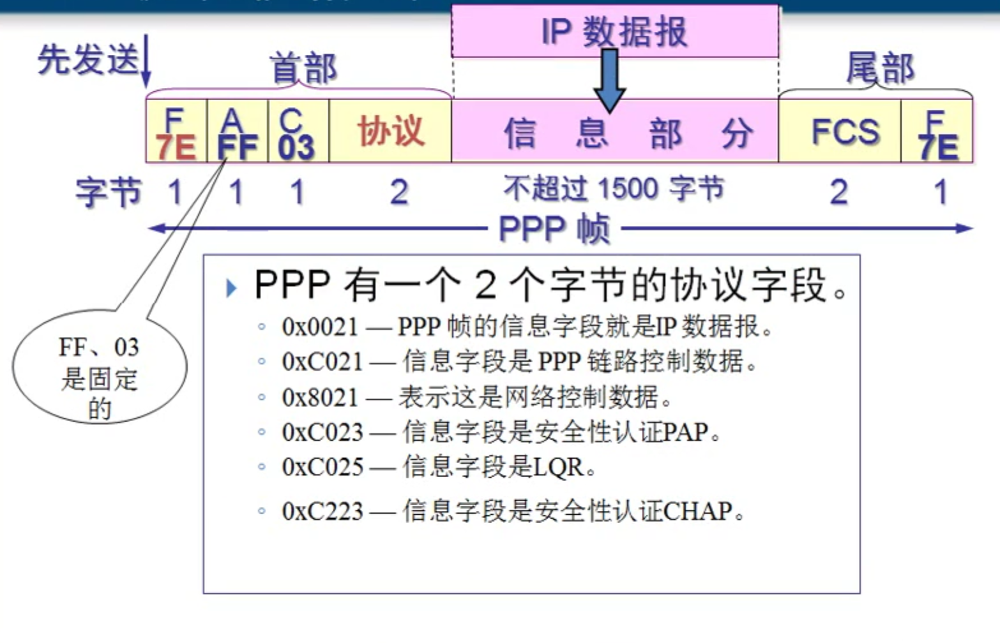

### PPP 协议帧格式
标志字段F = 0x7E (符号“OX”表示后面的字符是用十六进制表示。十六进制的 7E 的二进制表示是`01111110`)。

地址字段A 只置为OXFF。地址字段实际上并不起作用。
控制字段C 通常置为0X03。
PPP 是面向字节的，所有的PP帧的长度都是`整数字节`。
 

### 字节填充

问题: 信息字段中出现了标志字段的值，可能会被误认为是“标志”，怎么办?

- 将信息字段中出现的每个0X7E 字节转变成为2 字节序列(0x7D,0x5E)。
- 若信息字段中出现一个0X7D 的字节，则将其转变成为2字节序列(0x7D,
0x5D)。
- 若信息字段中出现ASCII码的控制字符(即数值小于0X20的字符)，则在
该字符前面要加入一个0X7D字节，同时将该字符的编码加以改变。

 

### `零`比特填充方法
PPP 协议用在SONET/SDH 链路时，是使用同步传输(一连串的比特连续传送)。这时PPP 协议采用`零比特填充方法`来实现透明传输.

在发送端，只要发现有5个连续1,则立即填入一个0。接收端对帧中的比特流进行扫描。每当发现5 个连续1时，
就把这5个连续1后的一个0删除，
 
 

### PPP协议不使用序号和确认机制

PPP 协议之所以不使用序号和确认机制是出于以下的考虑:
- 在数据链路层出现差错的概率不大时，使用比较简单的PPP 协议较为合理。
- 在因特网不境下，PPP 的信息字段放入的数据是IP 数据报。数据链路层的可靠传输并不能够保证网络层的传输也是可靠的。
- 帧检验序列FCS字段可保证无差错接收。


### PPP协议的工作状态
当用户拨号接入ISP 时，路由器的调制解调器对拨号做出确认，并建立一条物理连接。

PC 机向路由器发送一系列的LCP 分组(封装成多个PPP 帧)

这些分组及其响应选择一些PPP 参数，和进行网络层配置，NCP 给新接入的PC机分配一个临时的IP地址，使PC 机成为因特网上的一个主机。

通信完毕时，NCP 释放网络层连接，收回原来分配出去的IP 地址。接着，LCP 释放数据链路层连接。

最后释放的是物理层的连接。


# 使用广播信道的数据链路层(局域网)


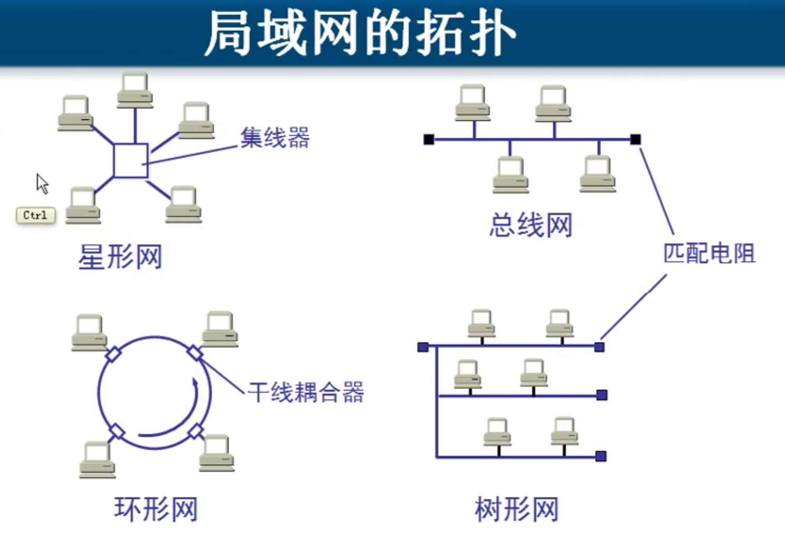

### 共享通信媒体
静态划分信道
- 频分复用
- 时分复用
- 波分复用
- 码分复用

动态媒体接入控制(多点接入)
- 随机接入(主要被以太网采用! )
- 受控接入，如多点线路探询(polling),或轮询。(目前已不被采用)

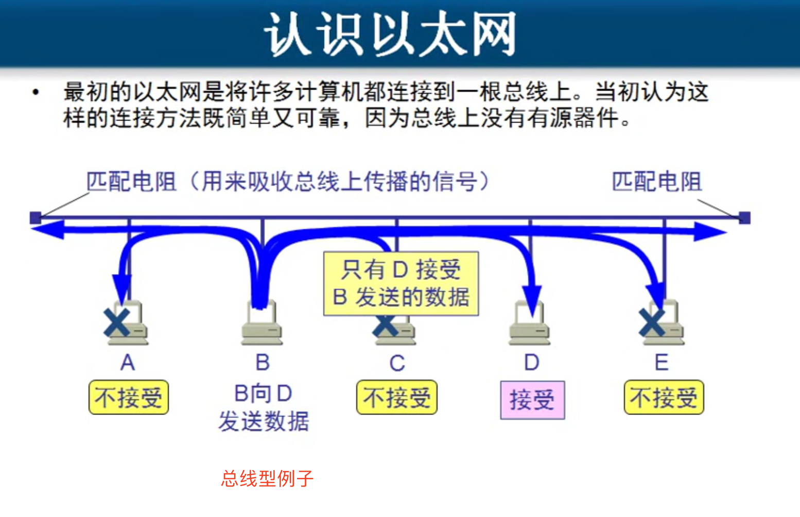


总线上的每一个工作的计算机都能检测到B 发送的数据信号。
由于只有计算机D 的地址与数据帧首部写入的地址一致，因此只有D 才
接收这个数据帧。
其他所有的计算机(A,C和E) 都检测到不是发送给它们的数据帧，因此
就丢弃这个数据帧而不能够收下来。
具有`广播`特性的总线上实现了一对一的通信。

所谓的广播是说所有的计算机都能收到信号


### 载波监听多点接入/碰撞检测以太网使用CSMA/CD协议

CSMA/CD 表示Carrier Sense MultipleAccess with Collision Detection。

“`多点接入`”表示许多计算机以多点接入的方式连接在一根总线上。
`载波监听`”是指每一个站在发送数据之前先要检测一下总线上是否有
其他计算机在发送数据，如果有，则暂时不要发送数据，以免发生
碰撞。
“载波监听”就是用电子技术检测总线上有没有其他计算机发送的数据
信号。

### 碰撞检测

`碰撞检测`”就是计算机边发送数据边检测信道上的信号电压大小。
- 当几个站同时在总线上发送数据时，总线上的信号电压摆动值将会增大(互相叠加)。
- 当一个站检测到的信号电压摆动值超过一定的门限值时，就认为总线上至少有两个站同时在发送数据，表明产生了`碰撞`。
-所谓“碰撞”就是发生了冲突。因此“碰撞检测”也称为“`冲突检测`”。
`检测到碰撞后`
- 在发生碰撞时，总线上传输的信号产生了严重的失真，无法从中恢复出有用的信息来。
- 每一个正在发送数据的站，一旦发现总线上出现了碰撞，就要立即停止发送，免得继续浪费网络资源，然后等待一段随机时间后再次发送。


### 电磁波在总线上的`有限传播速率`的影响
当某个站监听到总线是空闲时，也可能总线并非真正是空闲的。
A 向B 发出的信息，要经过一定的时间后才能传送到B。
B若在A 发送的信息到达B 之前发送自己的帧(因为这时B 的载波监听检
测不到A所发送的信息)，则必然要在某个时间和A 发送的帧发生碰
撞。
碰撞的结果是两个帧都变得无用。


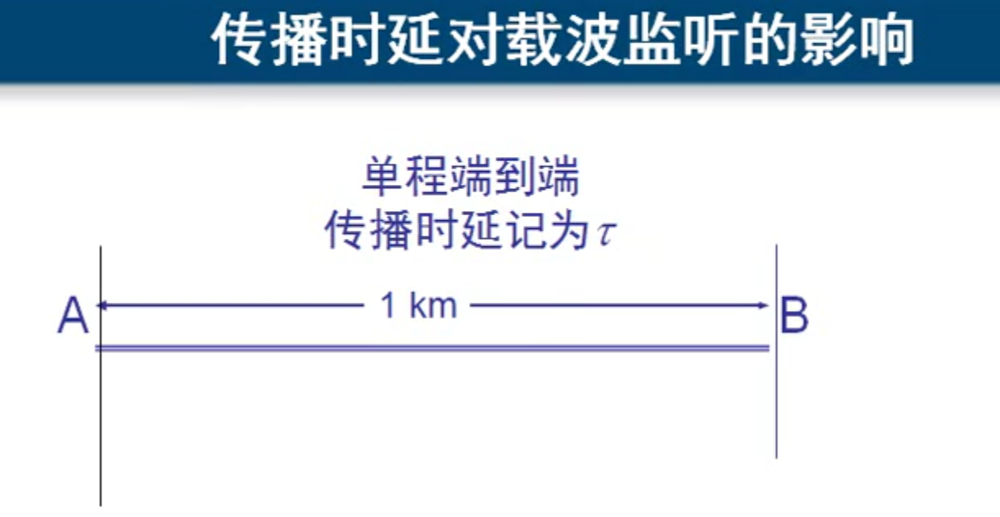


使用CSMA/CD协议的以太网不能进行全双工通信而只能进行双向交替通
信(半双工通信)。
每个站在发送数据之后的一小段时间内，存在着遭遇碰撞的可能性。
这种发送的不确定性使整个以太网的平均通信量远小于以太网的最高数
据率。

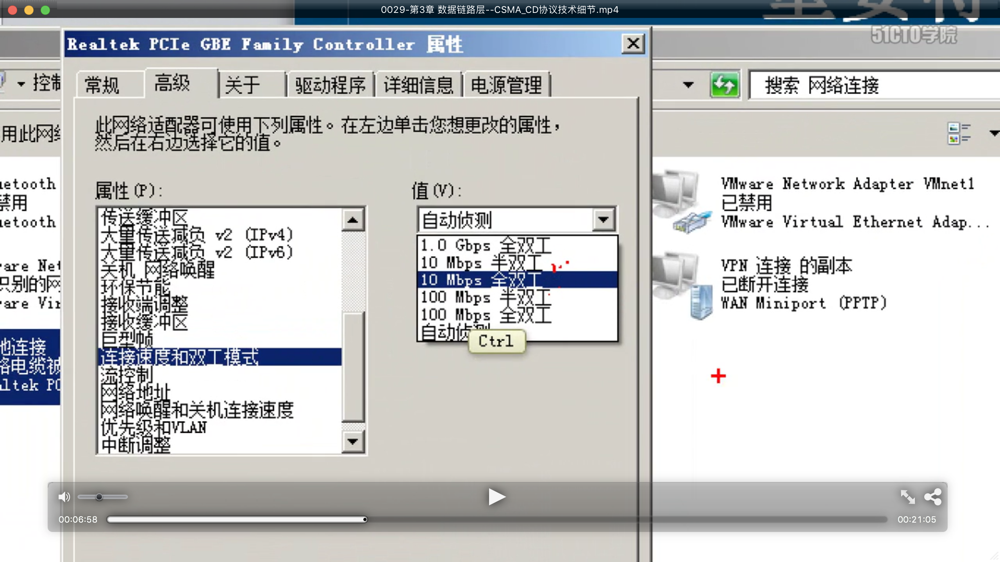

### 争用期
最先发送数据帧的站，在发送数据帧后至多经过时间2t (两倍的端到端往返时延) 就可知道发送的数据帧是否遭受了碰撞。

经过争用期这段时间还没有检测到碰撞，才能肯定这次发送不会发生碰撞。

以太网的争用期
- 以太网的端到端往返时延2t称为争用期，或碰撞窗口。通常，取51.2US为争用期的长度。
- 对于10 Mb/s 以太网，在争用期内可发送512bit,即64字节。
- 以太网在发送数据时，若前64字节未发生冲突，则后续的数据就不会发生冲突。

最短有效帧长
- 如果发生冲突，就一定是在发送的前64字节之内。
- 由于一检测到冲突就立即中止发送，这时已经发送出去的数据一定小于64 字节。
- 以太网规定了最短有效帧长为64字节，凡长度小于64字节的帧都是由于冲突而异常中止的无效帧。

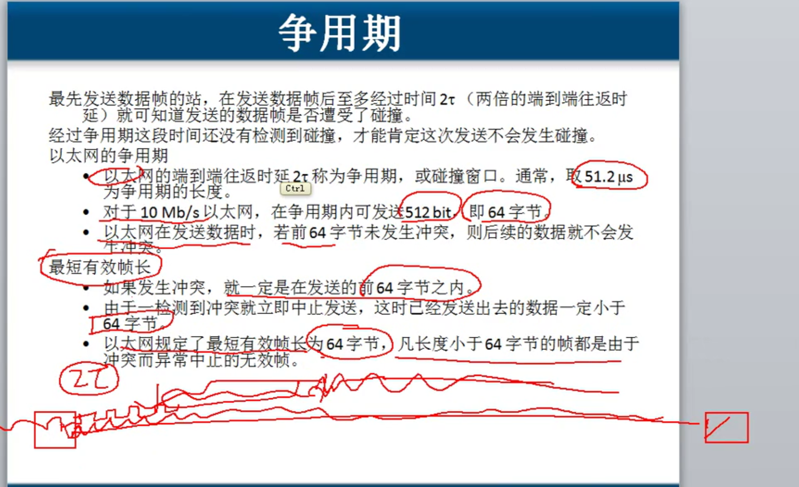

2t 不变是51.2微妙
100M/s 5120bit
10M/s   512bit

网线越长 2t 时间就越长


### 二进制指数类型退避算法
发生碰撞的站在停止发送数据后，要推迟(退避)一个随机时间才能再发送数据。

- 确定基本退避时间，一般是取为争用期2t。
- 定义参数k,k= Min[重传次数，10]
- 从整数集合[0,....(2*-1)]中随机地取出一个数，记为r。重传所需的时延就是r倍的基本退避时间。
-  当重传达16 次仍不能成功时即丢弃该帧，并向高层报告。
P82 例子

` 广播信道说的就是总线型`


# 以太网
- 概述
- 拓扑
- 信道利用率
- MAC层


### 以太网的两个标准
- DIX Ethernet V2 是世界上第一个局域网产品(以太网) 的规约。
- IEEE 的 802.3 标准。

DIX EthernetV2 标准与IEEE 的802.3 标准只有很小的差别，因此可以
将802.3 局域网简称为“`以太网`”
严格说来，`以太网`”应当是指符合DIX Ethernet V2 标准的局域网


### 以太网与数据链路层的两个子层
为了使数据链路层能更好地适应多种局域网标准，802委员会就将局域网的数据链路层拆成两个子层:

- 逻辑链路控制`LLC (Logical Link Control)`子层
- 媒体接入控制`MAC (Medium Access Control)`子层。

与接入到传输媒体有关的内容都放在MAC子层，而LLC 子层则与传输媒体无关，不管采用何种协议的局域网对LLC子层来说都是透明的。

由于TCP/IP 体系经常使用的局域网是DIX EthernetV2 而不是802.3 标准中的几种局域网，因此现在802 委员会制定的逻辑链路控制子层LLC(即802.2 标准) 的作用已经不大了。
很多厂商生产的适配器上就仅装有`MAC协议` 而没有LLC协议。

### 以太网提供的服务

以太网提供的服务是不可靠的交付，即尽最大努力的交付。
当接收站收到有差错的数据帧时就丢弃此帧，其他什么也不做。差错的纠正由高层来决定。

如果高层发现丢失了一些数据而进行重传，但以太网并不知道这是一个重传的帧，而是当作一个新的数据帧来发送。

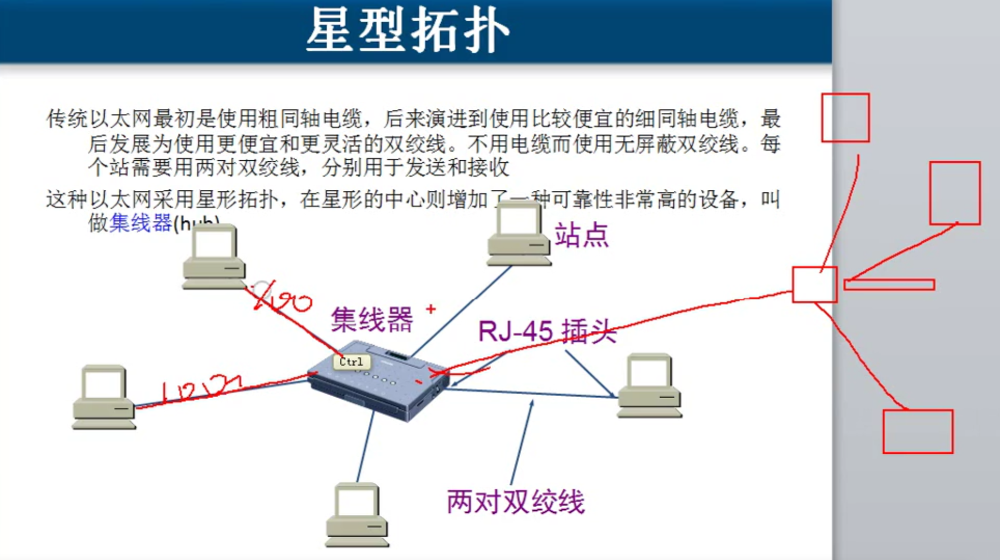
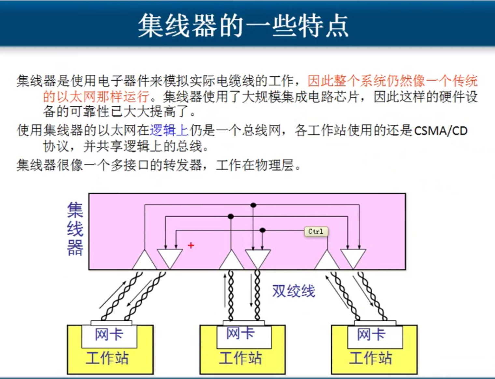


### 以太网的信道利用率
以太网的信道被占用的情况:
争用期长度为2r,即端到端传播时延的两倍。检测到碰撞后不发送干扰
信号。
帧长为L(bit),数据发送速率为C(b/s),因而帧的发送时间为L/C= To (s)。


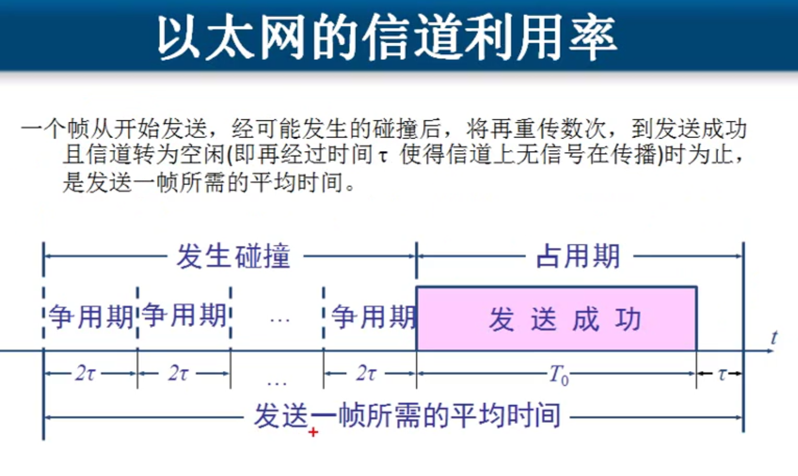

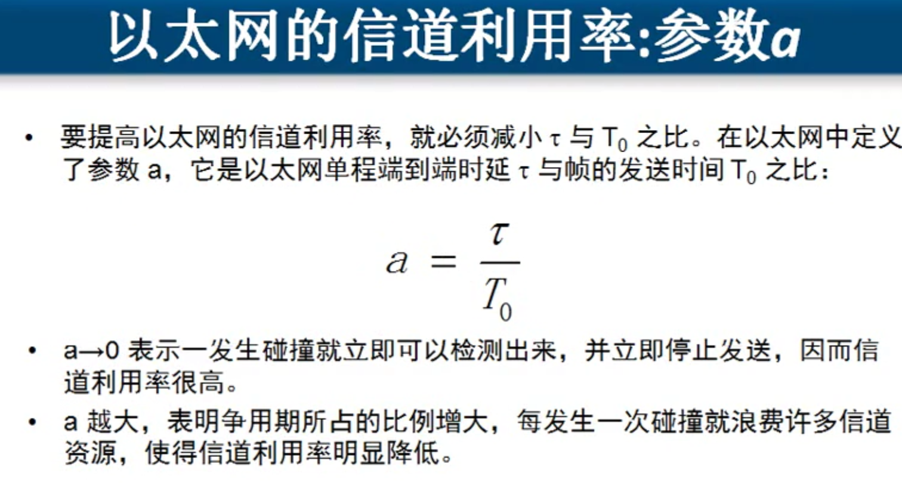
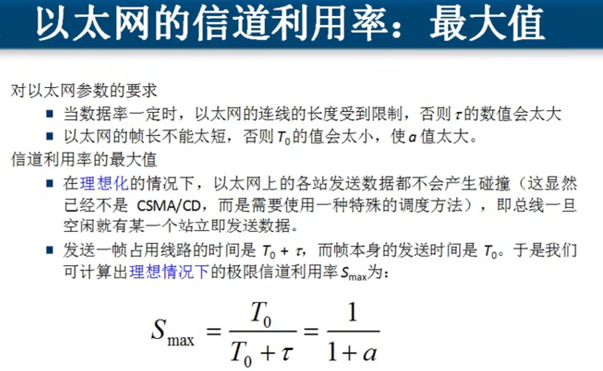
