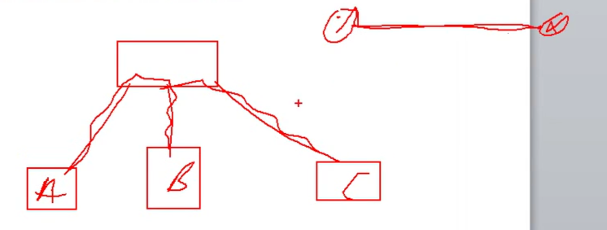
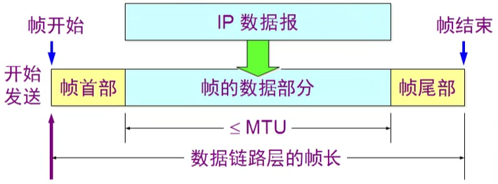

```

数据链路层基本概念和基本问题

	数据链路层信道类型
		点到点信道
		广播信道

    链路和数据链路
	帧 帧头 帧尾 物理层 地址校验值

数据链路层解决的三个基本问题
	1. 封装成帧
	2. 透明传输
	3. 差错控制
```

# 数据链路层-基本概念


数据链路层基本概念及基本问题

```

基本概念
三个基本问题

```

两种情况下的数据链路层

```

使用点对点信道的数据链路层
使用广播信道的数据链路层

```
以太局域网(以太网)
扩展以太网
高速以太网

## 数据发送模型  数据链路层的简单模型


# 数据链路层的信道类型

数据链路层使用的信道主要有以下两种类型:
***点对点信道***。这种信道使用一对一的点对点通信方式。

***广播信道***。这种信道使用一对多的广播通信方式，因此过程比较
复杂。广播信道上连接的主机很多，因此必须使用专用的共享信
道协议来协调这些主机的数据发送。




# 链路和数据链路

链路(link)是一条点到点的物理线路段，中间没有任何其他的交换结点。

```

■一条链路只是一条通路的一个丝成部分。

```

数据链路( data link) 除了物理线路外，还必须有通信协议来控制这些
数据的传输。若把实现这些协议的硬件和软件加到链路上，就构成
了数据链路。

```

现最常用的方法是使用适配器(即网卡)来实现这些协议的硬件和
软件。

一般的适配器都包括了数据链路层和物理层这两层的功能。

```


# 帧  


# 封装成帧


封装成帧(framing)就是在一段数据的前后分别添加首部和尾部，然后就构成了一个帧。确定帧的界限。
首部和尾部的一个重要作用就是进行帧定界。



### 用控制字符进行帧定界的方法举例
试想:
帧还未发送完，发送端出了问题，只能重发该帧。接收端却收到了前面的
半截子帧”，它会抛弃吗? 为什么?


# 透明传输

若传输的数据是ASCI码中“可打印字符(共95 个)”集时，一切正常。
若传输的数据不是仅由“可打印字符”组成时，就会出问题，如下图。


### 用字节填充法解决透明传输的问题

发送端的数据链路层在数据中出现控制字符“SOH”或“EOT”的前面插入一个转义
字符“ESC”(其十六进制编码是1B)。

`字节填充`(byte stuffing)或 `字守填充`(character stuffing)--接收端的数据链路层在
将数据送往网络层之前删除插入的转`义字符`。

如果转义字符也出现数据当中，那么应在转义字符前插入一个转义字符。当接收
端收到连续的两个转义字符时，就删除其中前面的一个。


# 差错控制


传输过程中可能会产生`比特差错:` 1可能会变成0而0 也可能变成1。
在一段时间内，传输错误的比特占所传输比特总数的比率称为`误码率`
BER (Bit Error Rate)。

误码率与信噪比有很大的关系。
为了保证数据传输的可靠性，在计算机网络传输数据时，必须采用各种
差错检测措施。
