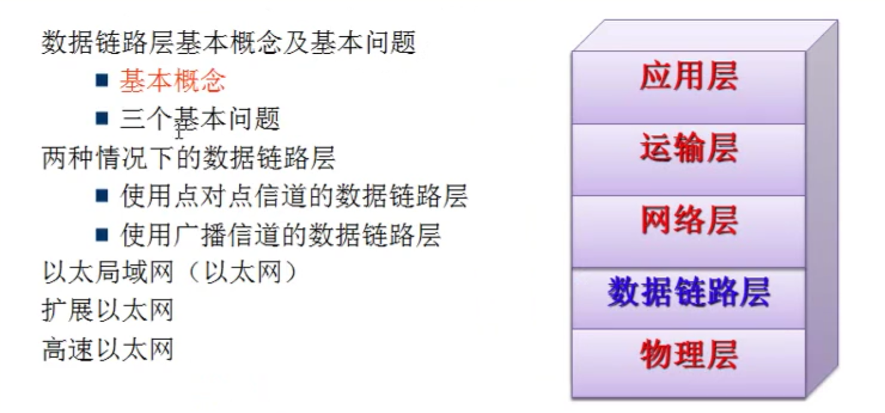
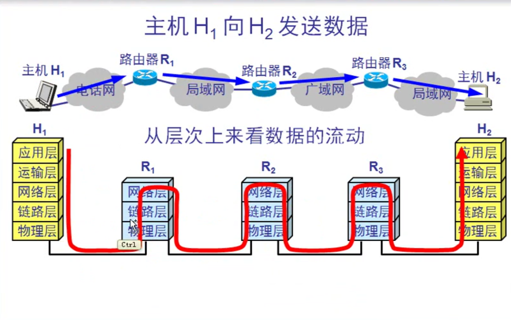
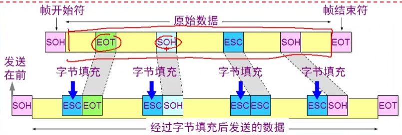
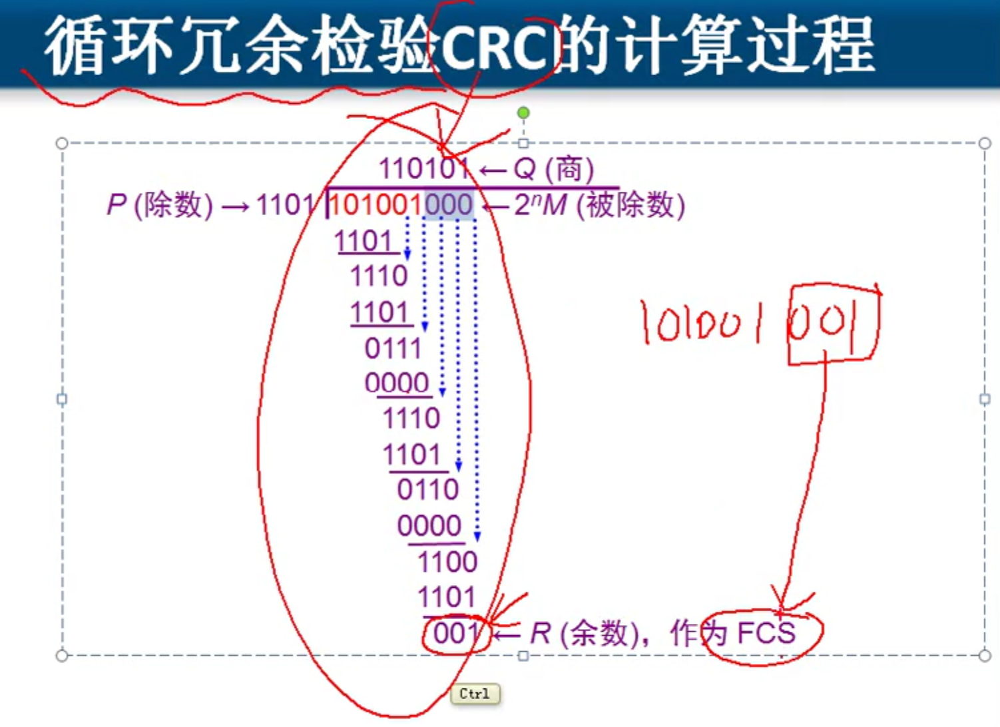
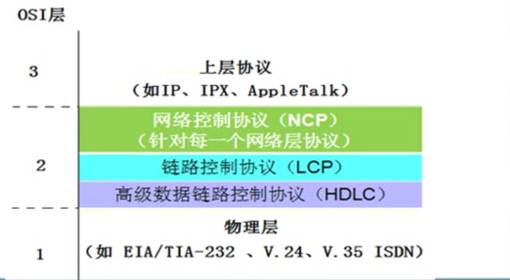
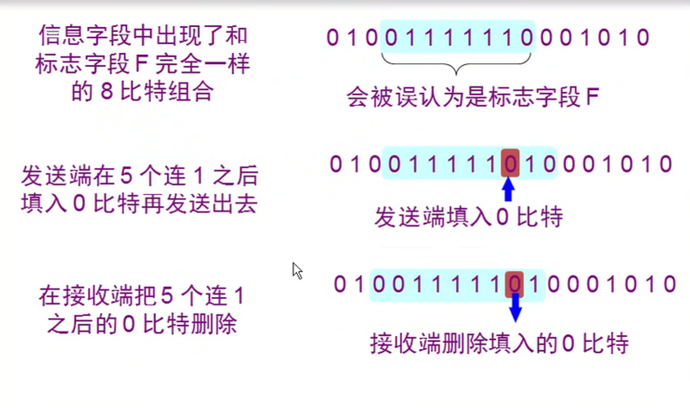

```

数据链路层基本概念和基本问题

	数据链路层信道类型
		点到点信道
		广播信道

    链路和数据链路
	帧 帧头 帧尾 物理层 地址校验值

数据链路层解决的三个基本问题
	1. 封装成帧
	2. 透明传输
	3. 差错控制
```

# 数据链路层-基本概念




数据链路层基本概念及基本问题

```

基本概念
三个基本问题

```

两种情况下的数据链路层

```

使用点对点信道的数据链路层
使用广播信道的数据链路层

```
以太局域网(以太网)
扩展以太网
高速以太网

## 数据发送模型  数据链路层的简单模型



# 数据链路层的信道类型

数据链路层使用的信道主要有以下两种类型:
***点对点信道***。这种信道使用一对一的点对点通信方式。

***广播信道***。这种信道使用一对多的广播通信方式，因此过程比较
复杂。广播信道上连接的主机很多，因此必须使用专用的共享信
道协议来协调这些主机的数据发送。


# 链路和数据链路

链路(link)是一条点到点的物理线路段，中间没有任何其他的交换结点。

```

■一条链路只是一条通路的一个丝成部分。

```

数据链路( data link) 除了物理线路外，还必须有通信协议来控制这些
数据的传输。若把实现这些协议的硬件和软件加到链路上，就构成
了数据链路。

```

现最常用的方法是使用适配器(即网卡)来实现这些协议的硬件和
软件。

一般的适配器都包括了数据链路层和物理层这两层的功能。

```


# 帧  


# 封装成帧


封装成帧(framing)就是在一段数据的前后分别添加首部和尾部，然后就构成了一个帧。确定帧的界限。
首部和尾部的一个重要作用就是进行帧定界。


### 用控制字符进行帧定界的方法举例
试想:
帧还未发送完，发送端出了问题，只能重发该帧。接收端却收到了前面的
半截子帧”，它会抛弃吗? 为什么?


# 透明传输

若传输的数据是ASCI码中“可打印字符(共95 个)”集时，一切正常。
若传输的数据不是仅由“可打印字符”组成时，就会出问题，如下图。


### 用字节填充法解决透明传输的问题

发送端的数据链路层在数据中出现控制字符“SOH”或“EOT”的前面插入一个转义
字符“ESC”(其十六进制编码是1B)。

`字节填充`(byte stuffing)或 `字守填充`(character stuffing)--接收端的数据链路层在
将数据送往网络层之前删除插入的转`义字符`。

如果转义字符也出现数据当中，那么应在转义字符前插入一个转义字符。当接收
端收到连续的两个转义字符时，就删除其中前面的一个。



# 差错控制


传输过程中可能会产生`比特差错:` 1可能会变成0而0 也可能变成1。
在一段时间内，传输错误的比特占所传输比特总数的比率称为`误码率`
BER (Bit Error Rate)。

误码率与信噪比有很大的关系。
为了保证数据传输的可靠性，在计算机网络传输数据时，必须采用各种
差错检测措施。

### 循环冗余检验CRC

加的零必除数少一位


### 帧检验序列FCS
在数据后面添加上的冗余码称为`帧检验序列`FCS (Frame Check Sequence)。
循环冗余检验CRC和帧检验序列FCS并不等同。
■CRC是一种常用的`检错方法`，而FCS是添加在数据后面的`冗余码`。
■FCS 可以用CRC这种方法得出，但CRC 并非用来获得FCS 的唯一方
法。

### 接收端对收到的每一帧进行CRC 检验
检验:
```

若得出的余数R=0,则判定这个帧没有差错，就接受(accept)。
若余数R0,则判定这个帧有差错，就丢弃。

```
特点:
```

但这种检测方法并不能确定究竟是哪一个或哪几个比特出现了差
错。
只要经过严格的挑选，并使用位数足够多的除数P,那么出现检测
不到的差错的概率就很小很小。

```
关于CRC的更多的知识
http://blog.chinaunix.net/u2/69737/showart_1658667.html


# 两种情况下的数据链路层
### 使用点对点信道的数据链路层
### 使用广播信道的数据链路层

## 使用点对点信道的数据链路层
PPP 协议
现在全世界使用得最多的数据链路层协议是点对点协议PPP (Point-to-Point Protocol)。
用户使用拨号电话线接入因特网时，一般都是使用PPP 协议。
 


PPP协议应该满足的要求:
简单一一这是`首要的要求`
■`封装成帧`
■`透明性`
■多种网络层协议
■多种类型链路
■`差错检测`
■检测连接状态
■最大传送单元
■网络层地址协商
■数据压缩协商

PPP协议不需要满足的要求:
- 纠错
- 流量控制
- 序号
- 多点线路
- 半双工或单工链路


### PPP协议的组成
1992 年制订了PPP 协议。经过1993 年和1994 年的修订，现在的PPP 协
议已成为因特网的正式标准[RFC1661]。

PPP 协议有三个组成部分
- 数据链路层协议可以用于异步串行或同步串行介质。
- 它使用LCP (链路控制协议) 建立并维护数据链路连接。
- 网络控制协议(NCP) 允许在点到点连接上使用多种网络层协议，如
图所示。

 

### PPP协议帧格式
 

### PPP 协议帧格式
标志字段F = 0x7E (符号“OX”表示后面的字符是用十六进制表示。十六进制的 7E 的二进制表示是`01111110`)。

地址字段A 只置为OXFF。地址字段实际上并不起作用。
控制字段C 通常置为0X03。
PPP 是面向字节的，所有的PP帧的长度都是`整数字节`。
 

### 字节填充

问题: 信息字段中出现了标志字段的值，可能会被误认为是“标志”，怎么办?

- 将信息字段中出现的每个0X7E 字节转变成为2 字节序列(0x7D,0x5E)。
- 若信息字段中出现一个0X7D 的字节，则将其转变成为2字节序列(0x7D,
0x5D)。
- 若信息字段中出现ASCII码的控制字符(即数值小于0X20的字符)，则在
该字符前面要加入一个0X7D字节，同时将该字符的编码加以改变。

 

### `零`比特填充方法
PPP 协议用在SONET/SDH 链路时，是使用同步传输(一连串的比特连续传送)。这时PPP 协议采用`零比特填充方法`来实现透明传输.

在发送端，只要发现有5个连续1,则立即填入一个0。接收端对帧中的比特流进行扫描。每当发现5 个连续1时，
就把这5个连续1后的一个0删除，
 
 

### PPP协议不使用序号和确认机制

PPP 协议之所以不使用序号和确认机制是出于以下的考虑:
- 在数据链路层出现差错的概率不大时，使用比较简单的PPP 协议较为合理。
- 在因特网不境下，PPP 的信息字段放入的数据是IP 数据报。数据链路层的可靠传输并不能够保证网络层的传输也是可靠的。
- 帧检验序列FCS字段可保证无差错接收。


### PPP协议的工作状态
当用户拨号接入ISP 时，路由器的调制解调器对拨号做出确认，并建立一条物理连接。

PC 机向路由器发送一系列的LCP 分组(封装成多个PPP 帧)

这些分组及其响应选择一些PPP 参数，和进行网络层配置，NCP 给新接入的PC机分配一个临时的IP地址，使PC 机成为因特网上的一个主机。

通信完毕时，NCP 释放网络层连接，收回原来分配出去的IP 地址。接着，LCP 释放数据链路层连接。

最后释放的是物理层的连接。
