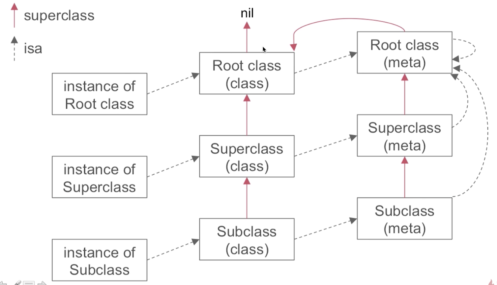

类对象和元类对象分别是什么?
类对象和元类对象的区别是什么?

# 对象, 类对象, 元类对象


- `类对象`存储实例方法列表等信息

- `元类对象`存储类方法列表等信息



根元类对象的superclass指针指向跟类对象, 这个指向决定了一个性质, 比如说我们调用了一个类方法, 类方法当然要冲元类对象中查找,逐级安装父类去查找, 然后在元类中找不到的时候就会找根类对象中同名的方法实例方法实现,

#  说我们调用的一个类方法,没有对应的实现,但是有同名的实例方法实现, 会不会发生崩溃?

不会! 因为根元类对象的superclass指针指向了根类对象, 当我们在元类对象中没有找到方法的情况下, 他就会顺着查找实例对象中的方法.找到同名方法就会进行实例方法的调用.


# 消息传递

/**
固定的要接收两个参数, id self,  SEL op(方法选择器名称), 然后后续才是我们方法传递参数. 
*/
## void objc_msgSend(void /* id self, SEL op,... */);

我们对于任何一个消息传递的书写如`[self class]`实际上通过编译器都会给我转换成 objc_msgSend(self, @selector(class) )的函数调用, 第一个参数就是消息传递的接收者self, 第二参数就是我们传递的消息名称或者说选择器, 实际上消息传递就是函数调用. 是发生在编译器层面的.


## void objc_msgSendSuper(void /* struct objc_super * super, SEL op, .... */)

```
// receiver 实际上就是当前对象

struct objc_super
{

/// Specifies an instance of a class
__unsafe_unretained id receiver;

}


```

 


