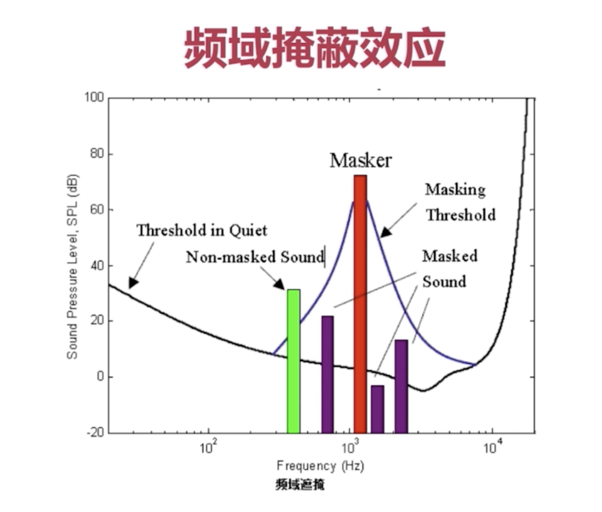

这一章介绍音视频的基础概念, 包括音视频的基础数据格式, 编码后的数据格式,以及不同格式之间的相互转换...(ps: 如何阅读"本书"的话)

# 1.1 声音的物理性质

一句话小结: 声音是波, 声波有三要素`频率`、`振幅`、`波形`, 人耳听力范围:20Hz~2kHz, 人耳对3~4kHz频率范围内的声音敏感,.

- 频率: 代表音阶的高低
- 振幅: 代表响度
- 波形: 代表音色

# 1.2 数字音频

- 关键词: `模拟信号数字化`,`采样`, `量化`, `编码`, `PCM(脉冲编码tiao'zhi)`, `量化格式(sampleFormat)`, `采样率(sampleRate)`, `声道数(channel)`

- 采样:`奈奎斯特定理就`是就是`采样定理`: 说的按比声音最高频率高`2倍以上`的频率对声音进行采样(也称AD转换), 从而使得经过数字化处理之后, 人耳听到的声音质量不会被降低.
  - 人耳听力范围:20Hz~2kHz, 所以采样频率是44.1kHz
  - 44.1kHz代表1秒回采样44100次.
  - 采样频率就是: 一秒采几个`点`

- 量化: 针对每个`点`来说的, 上面说什么`44.1kHz`说的是1秒钟采样44100次, 就说1秒钟采了44100个点了, 每一个点用1,200,还是23来表示就是量化的事.

- 编码: 所谓编码,就是按照一定的格式记录采样和量化后的数字数据, 比如顺序存储或压缩存储....

`采样深度`, `采样精度`, `量化格式(本书)`, 是一个东西.

- 采样精度(sampleFormat): 1般说的是多少多少位, 8位, 16位
  - 8位=1个字节==2的8次方,可以表示256个数, 也就是256个等级每个采样点数字化表示就256等级中的某一个.
  - 16位=2个字节==2的16次方, 可以表示65536个数, 65536个等级.

- 采样率(sampleRate): 说每秒采样多少个点, 44.1kHz = 44100, 就是说1秒钟采44100多个点

- 声道(channel): 单声道1, 双声道2

- PCM就是裸数据 =  sampleFormat *  sampleRate *  channel;
  - 说44.1kHz的采样率,双声道,采样精度是2字节, 一秒钟有多少PCM数据; 
    - 44100*2*16 = 141120 bit = 176400字节

PS: AAC一般用44.1k的采样

# 1.3 音频编码

关键词: `掩蔽效应`, `频域掩蔽效应`, `时域掩蔽效应`, `音频压缩技术`, `冗余数据`

## 频域掩蔽效应图解

x轴是频域,就是音频的高低, 越网友音频越高
y轴是我的声响, 越往上声音越大
原点就是20Hz的点, 20Hz以下我们是听不到的, 20kHz人也听不到, 所以不在20Hz~20kHz的我们全不要, 那么在20Hz~20kHz这里面的声音我们都能听到吗? 实际也不一定, 这跟声音的大小由密切关系.

# 1.4 图像的物理现象

# 1.5 图像的数值表示

# 1.6 视频的编码方式

# 1.7 小结